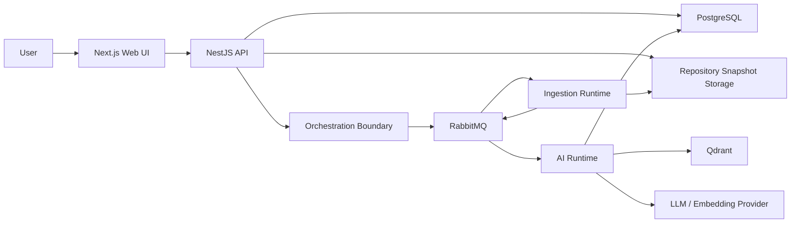

# Nurt Cloud

AI-powered code intelligence platform for:

- semantic repository understanding,
- grounded developer Q&A,
- automatic documentation generation,
- dependency-aware code retrieval.

Nurt Cloud is a thesis-driven engineering project focused on automatic code
documentation generation using language models and dependency analysis. The
system turns source repositories into a structured knowledge base that can be
searched, documented, visualized and queried through natural language.

This repository contains the user-facing Web/API layer:

- `apps/web` - Next.js workspace UI,
- `apps/api` - NestJS application API and control plane,
- `packages/*` - shared UI, TypeScript configuration and Web-owned contracts.

The wider Nurt Cloud platform also uses separate orchestration, ingestion, AI and
infrastructure runtimes. Their boundaries are described here, but their internal
implementation details are intentionally kept out of this repository.

## Why It Exists

Modern codebases change faster than their documentation. New developers often
need days or weeks to understand project structure, business logic and hidden
dependencies. Nurt Cloud explores whether language models, embeddings and
structure-aware repository analysis can reduce that onboarding cost.

The thesis topic behind the project is:

> Automatic Code Documentation Generation System Using Language Models and
> Dependency Analysis

The main research/product question:

> Can a system automatically analyze a repository, generate useful
> documentation, and answer developer questions using grounded code context?

## What It Does

1. A user adds a Git repository.
2. The API clones and snapshots the repository.
3. The snapshot is processed by the ingestion pipeline.
4. Source files are segmented into searchable units.
5. Embeddings are generated and stored in a vector database.
6. Documentation and chat answers are generated from retrieved code context.
7. The web UI exposes docs, chat, dependency graphs and API explorer views.

## Key Features

- Repository onboarding with public, SSH key or HTTPS token authentication.
- Branch-aware clone workflow.
- Status tracking for clone, ingest, embedding and documentation stages.
- Markdown documentation generated from indexed repository context.
- "Chat with Code" using retrieval-augmented generation.
- Dependency graph and API explorer views.
- Web-owned shared contracts for ingest and telemetry.
- Kubernetes/k3s-oriented deployment model.

## Architecture at a Glance



Core architectural choices:

- the Web API is a lightweight control plane,
- long-running ingest and AI work runs outside the API process,
- queues provide retryable asynchronous processing,
- repository snapshots are immutable pipeline inputs,
- generated responses are grounded in retrieved repository context,
- model and retrieval behavior can be evaluated independently from the UI.

For the full architecture, see [architecture.md](./architecture.md).

## Why Structure-Aware Analysis Matters

Many AI code tools treat repositories as plain text and split files into generic
chunks. Nurt Cloud is designed around a stronger pipeline:

```text
Raw source code
    ↓
Structural parsing
    ↓
Semantic segmentation
    ↓
Dependency-aware chunking
    ↓
Embeddings
    ↓
Grounded retrieval
```

That distinction matters because useful documentation and Q&A need more than
nearby text. They need module boundaries, symbols, imports, API endpoints and
dependency relationships.

## Engineering Challenges

Nurt Cloud is not just an LLM wrapper. The hard parts are mostly systems and
retrieval problems:

- repository-scale context windows,
- monorepo traversal,
- structure-aware segmentation,
- dependency-aware retrieval,
- incremental and repeatable indexing,
- hallucination reduction through grounded context,
- async queue orchestration,
- retry and dead-letter handling,
- deterministic processing status,
- model and embedding evaluation.

## Research Background

The project is aligned with a master's thesis plan covering:

- Transformer architecture as the foundation of modern language models,
- automatic text and documentation generation,
- bimodal models for programming languages and natural language,
- code embeddings and semantic search,
- retrieval-augmented generation,
- structural code analysis and dependency graphs,
- evaluation of generated documentation quality.

Primary literature and research context:

- Vaswani et al., "Attention Is All You Need",
- Feng et al., "CodeBERT: A Pre-Trained Model for Programming and Natural
  Languages",
- Tunstall, von Werra and Wolf, "Natural Language Processing with Transformers".

## Repository Layout

```text
.
+-- apps
|   +-- api                  # NestJS API
|   +-- web                  # Next.js frontend
+-- docs                     # Web-owned contracts and smoke/runbook notes
+-- packages
|   +-- codepath-common      # Shared TypeScript contracts
|   +-- eslint-config        # Shared ESLint configuration
|   +-- typescript-config    # Shared TypeScript configuration
|   +-- ui                   # Shared UI components and Tailwind globals
+-- storage                  # Local repository storage fallback
+-- Dockerfile               # API and frontend Docker targets
+-- architecture.md          # High-level platform architecture
```

## Tech Stack

### Web/API

- Next.js `16`
- React `19`
- NestJS `11`
- Fastify
- TypeScript
- Tailwind CSS `4`
- Drizzle ORM
- PostgreSQL
- Redux Toolkit
- Swagger/OpenAPI
- Jest, Vitest and Playwright

### Platform Runtime

- Rust orchestration and ingestion runtimes,
- Python AI workers,
- RabbitMQ,
- Qdrant,
- MinIO/S3-compatible snapshot storage,
- Keycloak-compatible authentication,
- Kubernetes/k3s manifests.

## Runtime Dependencies

| Service      | Default local address       | Purpose                      |
| ------------ | --------------------------- | ---------------------------- |
| Web frontend | `http://localhost:3000`     | Browser workspace            |
| Web API      | `http://localhost:3001/api` | Application API              |
| PostgreSQL   | `127.0.0.1:5432`            | Relational application state |
| RabbitMQ     | `127.0.0.1`                 | Queue transport              |
| Qdrant       | `127.0.0.1:6333`            | Vector search                |
| MinIO        | `127.0.0.1:9000`            | Repository snapshots         |
| Keycloak     | `127.0.0.1:8081`            | Optional identity provider   |
| Orchestrator | `127.0.0.1:8080`            | Job/RPC boundary             |

This repository does not currently include a full Docker Compose stack. The
production-like local deployment is maintained in the infrastructure runtime.

## Getting Started

Requirements:

- Node.js `>=20`
- Bun `1.3.5`
- PostgreSQL for basic API flows
- RabbitMQ, Qdrant, MinIO, Keycloak and platform runtimes for full end-to-end
  behavior

Install dependencies:

```bash
bun install
```

Prepare local API environment:

```bash
cp apps/api/.env.example apps/api/.env
```

Run the monorepo:

```bash
bun run dev
```

Or run apps separately:

```bash
bun run --cwd apps/api dev
bun run --cwd apps/web dev
```

Open:

- Web: `http://localhost:3000`
- API Swagger: `http://localhost:3001/api/docs`

## Development Commands

| Command                                | Description                         |
| -------------------------------------- | ----------------------------------- |
| `bun run dev`                          | Runs Turborepo dev tasks            |
| `bun run build`                        | Builds workspace packages/apps      |
| `bun run lint`                         | Runs workspace lint tasks           |
| `bun run format`                       | Formats TypeScript and Markdown     |
| `bun run --cwd apps/web typecheck`     | Type-checks the web app             |
| `bun run --cwd apps/web test:unit`     | Runs web unit tests                 |
| `bun run --cwd apps/web test:e2e`      | Runs Playwright tests               |
| `bun run --cwd apps/api test`          | Runs API tests                      |
| `bun run --cwd apps/api rabbit:verify` | Verifies RabbitMQ topology settings |

Recommended local checks:

```bash
bun run lint
bun run --cwd apps/web typecheck
bun run --cwd apps/web test:unit
bun run --cwd apps/api test
bun run build
```

## API Overview

All API routes are served under the global `/api` prefix.

| Area         | Purpose                                                   |
| ------------ | --------------------------------------------------------- |
| Auth         | Current user, login, logout and registration              |
| Repositories | Repository creation, listing and processing status        |
| Chat         | Repository chat sessions and prompt/answer flow           |
| Docs         | Documentation generation, retrieval and status            |
| Dependencies | Dependency graph data                                     |
| API Explorer | Endpoint discovery, OpenAPI export and API runner support |
| Metrics      | Runtime metrics                                           |

Swagger is available at:

```text
http://localhost:3001/api/docs
```

## Deployment

The root `Dockerfile` defines separate API and frontend targets:

```bash
docker build --target api-runtime -t codepath-web-api:local .
docker build --target web-runtime -t codepath-web-frontend:local .
```

The full platform deployment is managed outside this repository through
Kubernetes/k3s manifests. This repository owns the Web/API build artifacts and
runtime configuration surface.

## Documentation

- [architecture.md](./architecture.md) - high-level platform architecture,
  service boundaries and engineering rationale.
