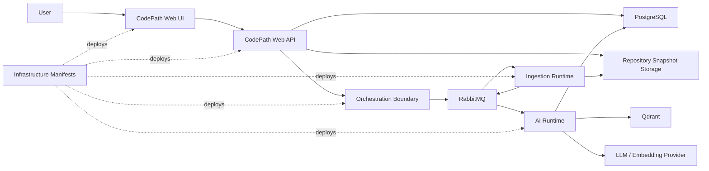
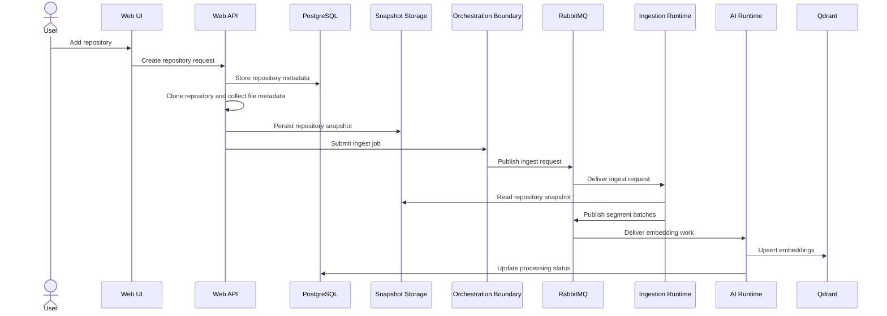
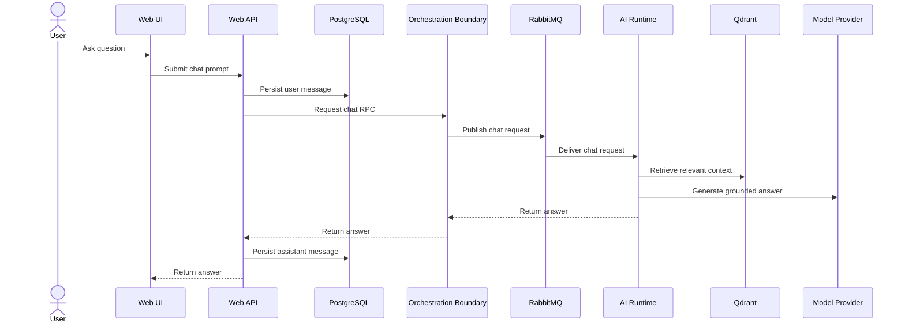
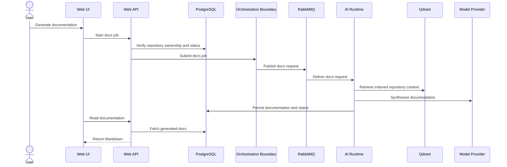
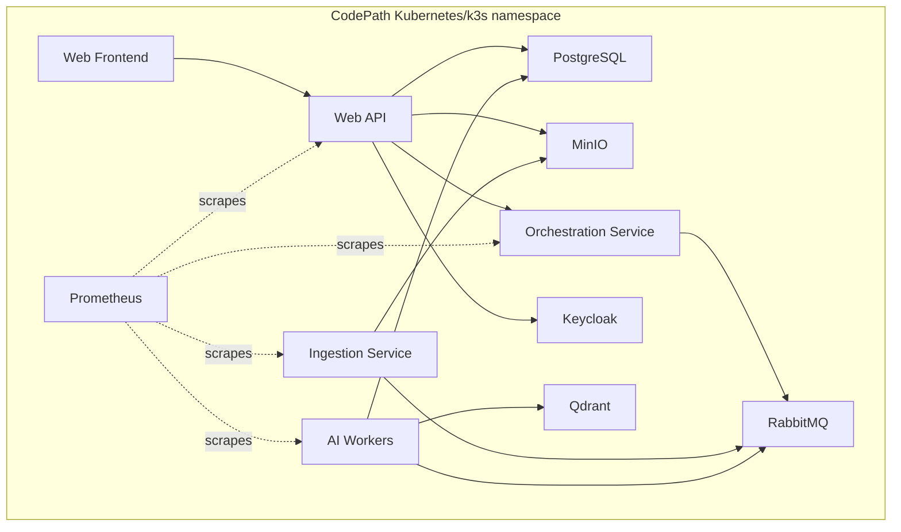

# CodePath Architecture

This document describes the architecture of the CodePath platform from the
perspective of `CodePath-Web`. It intentionally avoids implementation details,
source code paths and internal logic from sibling services. The goal is to
document boundaries, responsibilities, contracts and data flow without leaking
private module internals.

## 1. Architectural Goal

CodePath is a code intelligence platform for automatic documentation generation
and repository understanding. It combines:

- structural analysis of source code,
- dependency and API discovery,
- embeddings and semantic retrieval,
- retrieval-augmented generation,
- user-facing documentation and chat workflows.

The architecture separates user-facing control-plane responsibilities from
long-running ingestion and AI workloads.

## 2. Design Principles

1. **Control plane stays lightweight**
   The Web API owns users, repository metadata, permissions, status transitions
   and read APIs. Heavy parsing, embedding and generation work is delegated.

2. **Service boundaries are contract-first**
   Services communicate through HTTP endpoints, queue messages and versioned
   payload contracts. Internal implementation details remain private to each
   service.

3. **Repository snapshots are immutable processing inputs**
   A cloned repository is persisted as a snapshot before downstream services
   process it. This makes ingestion replayable and decouples workers from the
   API process.

4. **Asynchronous processing is the default**
   Long-running tasks such as ingest, embedding and documentation generation are
   handled through queues, retries and failure paths.

5. **Generated answers must be grounded**
   Documentation and chat responses should be based on retrieved repository
   context rather than free-form model output.

6. **The system supports scientific evaluation**
   Retrieval quality, documentation quality, latency and model choices should be
   measurable and reproducible.

## Why Structure-Aware Parsing Matters

Many AI-assisted code tools start with plain text chunking: split files by size,
embed the chunks and retrieve the closest matches. That approach is simple, but
it often cuts through function bodies, class boundaries, imports or module-level
relationships.

CodePath is designed around structure-aware repository understanding:

```text
Raw source code
    ↓
Structural parsing
    ↓
Semantic segmentation
    ↓
Dependency-aware chunking
    ↓
Embeddings
    ↓
Grounded retrieval
```

This does not mean every language feature must be fully modeled before the
system is useful. The important architectural distinction is that repository
content is treated as code with structure, not as arbitrary text. The pipeline is
designed to preserve useful boundaries such as files, modules, symbols, imports,
API endpoints and dependency relationships.

The practical benefits are:

- generated documentation can reference meaningful code units,
- retrieval can prefer context that belongs together semantically,
- dependency graphs can explain how parts of the system relate,
- chat answers can be grounded in more precise repository context,
- future parsing improvements can be introduced without changing the Web UI.

## Why Separate Runtimes

CodePath intentionally separates the Web/API control plane from long-running
ingestion and AI workloads.

| Reason                | Architectural effect                                                                                         |
| --------------------- | ------------------------------------------------------------------------------------------------------------ |
| Isolation             | Clone, ingest, embedding and generation failures do not crash the user-facing API process.                   |
| Scalability           | Ingestion and AI workers can scale independently from the Web UI and API.                                    |
| Retryability          | Queue-based jobs can use retry and dead-letter flows instead of blocking HTTP requests.                      |
| Model experimentation | Embedding and generation models can be changed or compared without rewriting the Web layer.                  |
| Fault boundaries      | Each runtime has a smaller responsibility and clearer operational failure modes.                             |
| Technology fit        | TypeScript, Rust and Python can be used where they are strongest without forcing one runtime for everything. |
| Scientific evaluation | Model/runtime experiments can run behind stable contracts while preserving the same product workflow.        |

The tradeoff is operational complexity: the platform requires more services,
clearer contracts and better observability. That tradeoff is intentional because
repository ingestion and AI generation are naturally asynchronous workloads.

## 3. System Context



## 4. Runtime Components

| Component              | Responsibility                                                                                | Notes                                                        |
| ---------------------- | --------------------------------------------------------------------------------------------- | ------------------------------------------------------------ |
| Web UI                 | Browser workspace for repository management, docs, graphs, API explorer and chat              | Owned by this repository                                     |
| Web API                | Application API, authentication, repository metadata, status tracking and orchestration calls | Owned by this repository                                     |
| Orchestration Boundary | HTTP boundary that publishes queue jobs and handles synchronous chat RPC                      | Separate service; documented only as an external boundary    |
| Ingestion Runtime      | Processes repository snapshots and publishes normalized code segments                         | Separate service; no internal implementation documented here |
| AI Runtime             | Embeddings, documentation generation, chat and ingest-status handling                         | Separate service; no internal implementation documented here |
| PostgreSQL             | Relational application data                                                                   | Shared platform dependency                                   |
| Snapshot Storage       | Repository snapshot storage, usually S3-compatible                                            | Shared platform dependency                                   |
| RabbitMQ               | Asynchronous job transport                                                                    | Shared platform dependency                                   |
| Qdrant                 | Vector search storage                                                                         | Shared platform dependency                                   |
| Keycloak               | Optional identity provider                                                                    | Shared platform dependency                                   |
| Infrastructure         | Kubernetes/k3s deployment manifests and environment wiring                                    | Separate repository                                          |

## 5. CodePath-Web Internal Layers

```text
apps/web
  Browser UI, route layouts, forms, dashboard, repository views,
  documentation view, graph views, API explorer and chat UI.

apps/api
  NestJS application API, auth, repository workflows, docs/chat/graph/API
  endpoints, metrics and external orchestration calls.

packages/ui
  Shared UI primitives, theme and frontend utilities.

packages/codepath-common
  Shared TypeScript contracts for Web-owned data shapes.

packages/eslint-config and packages/typescript-config
  Shared project tooling.
```

## 6. Primary Data Flow

### 6.1 Repository Onboarding and Ingest



### 6.2 Chat with Code



### 6.3 Documentation Generation



## 7. Contracts and Boundaries

### HTTP Boundaries

The Web UI communicates with the Web API through `/api/*`. The Web API uses an
orchestration HTTP boundary for job submission and chat RPC.

Publicly documented API areas:

- authentication,
- repositories,
- documentation,
- chat,
- dependency graphs,
- API explorer,
- metrics.

### Queue Boundaries

RabbitMQ is the asynchronous boundary for:

- ingest jobs,
- segment batches,
- embedding work,
- documentation jobs,
- chat requests,
- failure/status events.

Queue messages should remain versioned and language-agnostic.

### Shared Type Contracts

Web-owned shared contracts live in `packages/codepath-common`. They are used for
data shapes that cross frontend/backend boundaries or represent platform message
contracts owned by Web.

## 8. Data Ownership

| Data                                | Owner                                | Storage                                 |
| ----------------------------------- | ------------------------------------ | --------------------------------------- |
| Users and sessions                  | Web API                              | PostgreSQL and cookies/JWT              |
| Repository metadata                 | Web API                              | PostgreSQL                              |
| Repository snapshots                | Web API produces, ingestion consumes | S3-compatible storage or local fallback |
| File metadata                       | Web API                              | PostgreSQL                              |
| Dependency/API explorer read models | Web API                              | PostgreSQL                              |
| Chat history                        | Web API                              | PostgreSQL                              |
| Generated documentation             | AI runtime writes, Web API reads     | PostgreSQL                              |
| Embeddings                          | AI runtime                           | Qdrant                                  |
| Pipeline telemetry                  | Producing service                    | Logs/metrics pipeline                   |

## 9. Status Model

Repository processing is represented as independent status dimensions:

- clone status,
- embedding status,
- documentation status.

The statuses allow the UI and API to communicate whether a repository is ready
for documentation or chat workflows. Documentation generation is gated on
successful repository indexing/embedding.

## Engineering Challenges

The main difficulty in CodePath is not calling a language model. The harder
engineering problems are about making repository-scale context reliable,
repeatable and useful.

| Challenge                        | Why it matters                                                                                                                |
| -------------------------------- | ----------------------------------------------------------------------------------------------------------------------------- |
| Repository-scale context windows | Real projects exceed model context limits, so retrieval and summarization must select the right evidence.                     |
| Monorepo traversal               | Large repositories contain many languages, packages, generated files and nested project boundaries.                           |
| Structure-aware segmentation     | Chunks should preserve meaningful code units instead of arbitrary text windows.                                               |
| Dependency-aware retrieval       | Relevant context often lives across imports, modules or API boundaries, not only near matching text.                          |
| Incremental indexing             | Reprocessing entire repositories is expensive; the architecture should support repeatable and eventually incremental updates. |
| Hallucination reduction          | Generated docs and answers must be grounded in retrieved source context and clear status gates.                               |
| Queue orchestration              | Ingest, embedding and documentation jobs need retries, dead-letter handling and operator visibility.                          |
| Deterministic status transitions | The UI must reflect actual processing state, not only job submission state.                                                   |
| Model evaluation                 | Different embedding/generation models need measurable comparison across quality and latency.                                  |
| Secret handling                  | Repository credentials and private code must not leak through logs, telemetry or model-provider boundaries.                   |

These challenges are the reason the platform is designed around contracts,
snapshots, queues, telemetry and separated runtimes instead of a single
request-response LLM flow.

## 10. Security and Privacy Boundaries

Security-sensitive areas:

- repository access secrets,
- JWT/session handling,
- Keycloak token validation,
- CORS configuration,
- repository snapshot storage,
- logs and telemetry,
- prompts and model-provider requests.

Expected security posture:

- secrets must not be logged,
- repository clone credentials should be scoped read-only,
- private repository content should flow only through approved platform services,
- generated documentation and chat answers should be scoped to the authenticated
  repository owner,
- external model providers should be configurable and avoid accidental data
  exposure when local/offline processing is required.

## 11. Observability

The platform exposes operational signals through:

- health/readiness endpoints,
- Prometheus-style metrics,
- structured telemetry events,
- queue retry and dead-letter behavior,
- repository status fields visible to users.

Operationally important signals:

- repository clone failures,
- ingest failures,
- embedding completion,
- documentation job progress/failure,
- chat timeout/failure,
- queue lag and DLQ growth,
- model-provider latency.

## 12. Research and Evaluation Architecture

The broader project is designed to support thesis evaluation. The relevant
measurable areas are:

- retrieval quality: recall@k, precision@k, MRR,
- documentation quality: correctness, completeness, groundedness and structure,
- chat answer quality: usefulness, source grounding and hallucination rate,
- performance: indexing time, job latency and response latency,
- model comparison: embedding model, generation model, chunk size and top-k
  variants.

The architecture keeps model workloads outside the Web API so that experiments
can compare AI runtime behavior without rewriting user-facing workflows.

## 13. Deployment View



The infrastructure repository owns cluster manifests, service names, secrets and
environment profiles. `CodePath-Web` owns only the Web/API build artifacts and
their runtime configuration surface.

## 14. Non-Goals

This architecture document does not:

- document private implementation internals of sibling services,
- expose source code from other repositories,
- prescribe one final model provider,
- guarantee generated documentation is always correct,
- replace security review for private repository processing,
- replace formal thesis evaluation.

## 15. Future Directions

Planned or research-oriented extensions:

- richer repository-level graph exploration,
- stronger documentation quality gates,
- model canary and rollback playbooks,
- code review and refactoring assistance,
- security audit assistance,
- automatic unit test generation,
- onboarding mode for guided codebase tours,
- changelog generation from code changes.
